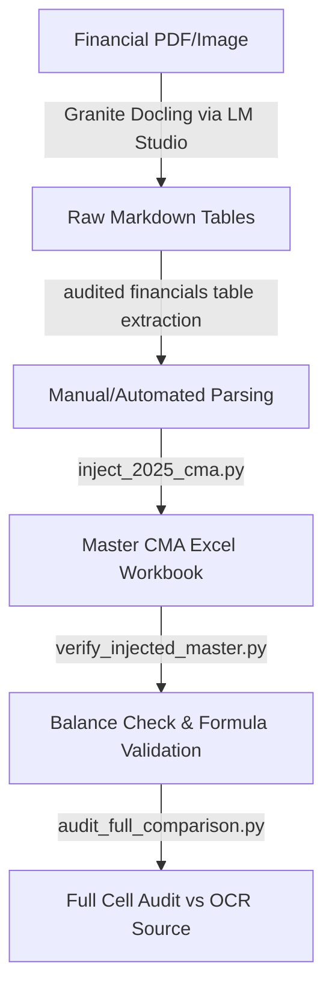

# CMA Data Extraction & Injection System Guide

This guide explains the setup, pipeline algorithm, and running instructions for the automated financial data extraction and Excel injection system. The system processes audited financial markdown tables (derived from OCR) and accurately populates the master CMA (Comparability and Management Analysis) Excel workbook.

---

## 1. System Overview & Architecture

The system is designed to take raw OCR output files (e.g., Markdown files generated by Docling) containing audited financial statements and inject them directly into a master Excel file (`CARGOSOL LOGISTICS LTD CMA.xlsx`) with zero errors, maintaining strict decimal precision and preserving all underlying Excel formulas.



---

## 2. Setup Instructions

### Prerequisites
- Python 3.10 or higher.
- A virtual environment is recommended to manage dependencies.

### Installation
1. Navigate to the repository root directory:
   ```powershell
   cd "C:\The Sketchbook\Vector-Code\OCR"
   ```
2. Initialize and activate the virtual environment:
   ```powershell
   python -m venv .venv
   .\.venv\Scripts\Activate.ps1
   ```
3. Install required packages:
   ```powershell
   pip install -r requirements.txt
   ```
   *Note: Key libraries used are `openpyxl` (for Excel manipulation preserving formulas), `pandas` (for table parsing), and `jinja2` (for reporting).*

---

## 3. The Extraction & Injection Algorithm

The core algorithm is split into three main components: **Backup & Injection**, **Verification & Balancing**, and **Comprehensive Audit**.

### A. Backup & Injection (`inject_2025_cma.py`)
1. **Safety Backup**: Before making any changes, the script creates a timestamped copy of the master Excel sheet under `app/outputs/`.
2. **Formula Preservation**: The workbook is loaded with `openpyxl.load_workbook(..., data_only=False)`. This ensures that all existing formulas in other cells are not destroyed or overwritten with static values.
3. **Targeted Injections (CMA sheet)**:
   - Specific cells in **Column J (representing 2025 Audited data)** are targeted for update.
   - Values are mapped to specific row indices based on audited notes (e.g. Note 21 for sales, Note 23 for expenses, Note 7 for current borrowings).
   - Complex cells are injected with Excel formulas to preserve dynamic sheet logic (e.g., Administrative Expenses are injected as `=716.42+417.11-J46`).
4. **Targeted Injections (DEPRECIATION sheet)**:
   - Column C (Gross Block on 01.04.2025) and Column F (Depreciation on 01.04.2025) are updated with audited starting balances for each block of asset (Land, Buildings, Computers, Vehicles, etc.).

### B. Verification & Balancing (`verify_injected_master.py`)
1. **Value Evaluation**: The workbook is loaded with `data_only=True` to force Excel/openpyxl to evaluate all formulas.
2. **Balance Sheet Verification**:
   - The script pulls values for FY23, FY24, and FY25 (Columns H, I, J).
   - It performs the algebraic sums for both **Total Assets** and **Total Liabilities**.
   - It verifies that `abs(Total Assets - Total Liabilities) < 0.15 Lakhs` (accounting for rounding differences).
3. **Formula Health Check**: Verifies that ratios (e.g. Current Ratio, Debt/Equity) evaluate to numbers rather than errors like `#DIV/0!`.

### C. Comprehensive Audit (`audit_full_comparison.py`)
1. **OCR Matching**: Cell-by-cell compares all injected values against the source audited markdown `Financials 24-25(standalone)_raw_ocr.md`.
2. **Discrepancy Reporting**: Detects and reports any data entry mismatches down to the decimal.

---

## 4. How to Run the Pipeline

Follow these steps to run the injection, verification, and audit pipelines:

### Step 1: Run the Injection Script
This script populates the 2025 column in both the `CMA` and `DEPRECIATION` sheets of the master Excel file:
```powershell
python scripts/inject_2025_cma.py
```

### Step 2: Verify and Balance Check
Confirm that the balance sheets are balanced and formulas evaluate correctly across all 3 years (FY23, FY24, and FY25):
```powershell
python scripts/verify_injected_master.py
```

### Step 3: Run the Audit Script
Ensure that every injected value matches the source markdown document exactly:
```powershell
python -c "import sys; sys.path.append('.'); from brain.0df1476d_a6e3_4f2e_88d2_59b2f2363233.scratch.audit_full_comparison import main; main()"
```
*(Alternative: Copy the audit script from the brain scratch directory to your root/scripts directory to run directly)*

---

## 5. Streamlined Dynamic End-to-End Pipeline

To eliminate hardcoded logic, a configuration-driven, dynamic pipeline has been implemented:

### Core Pipeline Components
1. **Dynamic Mapping Configuration (`app/schemas/cma_excel_map.py`)**: Maps each Excel row in the master sheet directly to its corresponding extraction section and field name (such as `"Domestic Sale"`, `"Short Term loans from Applicant Bank"`).
2. **Generic Injector Service (`app/services/cma_excel_injector.py`)**: 
   * Reads the master Excel workbook preserving all formulas.
   * Scans Row 11 of the `CMA` sheet to locate the column corresponding to the target year (e.g. `2025` -> Column `J`, `2026` -> Column `K`).
   * Scans Row 3 of the `DEPRECIATION` sheet for the correct opening date column (e.g. `01.04.2025`).
   * Writes values from the JSON extraction directly into the mapped cells, keeping everything else intact.
   * Supports custom override values for note-specific arithmetic expressions.

### Running the CLI Pipeline
Run the end-to-end extraction and injection command:
```powershell
python scripts/streamlined_pipeline.py --pdf "Input_Data/Financials 24-25(standalone).pdf" --excel "Input_Data/CARGOSOL LOGISTICS LTD CMA.xlsx" --year "2024-25"
```
Options:
* `--pdf`: Path to input PDF financial statement.
* `--excel`: Path to master CMA Excel workbook.
* `--year`: Target financial year (e.g. `2024-25`).
* `--no-overrides`: Disables row overrides and writes JSON values directly.

### Running via Web API
The system includes a streamlined API endpoint:
* **`POST /cma/inject/streamlined`**
  * **Payload**: `file` (PDF statement upload), `target_year` (financial year string), `apply_overrides` (boolean).
  * **Action**: Runs the entire Docling OCR, field extraction, year matching, and master Excel injection in one go.
  * **Response**: Returns the fully updated Excel workbook file for instant download.

